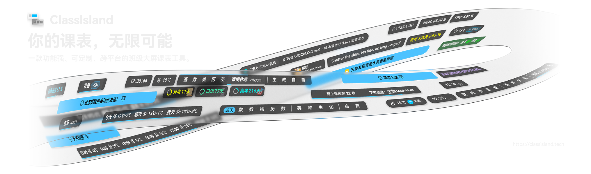

<!--markdownlint-disable MD001 MD033 MD041 MD051-->

<div align="center">

# <image src="ClassFabric/Assets/AppLogo_AppLogo.svg" height="32" width="32"/> ClassFabric

**灵动课表，一触即达。**



[](https://github.com/ansoukin/ClassFabric/releases)
[](https://github.com/ansoukin/ClassFabric/releases/latest)
[](https://github.com/ansoukin/ClassFabric/stargazers)<br/>


</div>

---

**ClassFabric** 是 [ClassIsland](https://github.com/ClassIsland/ClassIsland) 的精简派生版，一款面向班级多媒体屏幕的课表信息显示工具，灵感源于 iOS 灵动岛（Dynamic Island）。

它以一条半透明胶囊横条悬浮于桌面，实时显示当前课程、倒计时、天气等信息，上下课前自动提醒——让教师和学生只需一瞥，就能掌握课堂节奏，无需切换窗口、无需额外操作。

#### [📚 ClassIsland 文档](https://docs.classisland.tech)

---

## 与 ClassIsland 的区别

| 维度 | ClassIsland | ClassFabric |
| --- | --- | --- |
| 定位 | 全功能课表工具，插件与主题生态丰富 | 精简版，聚焦核心教学场景 |
| 代码量 | 较大，功能模块齐全 | 大幅精简，便于理解和二次开发 |
| 平台支持 | Windows / macOS / Linux | Windows / macOS / Linux |
| 内置组件 | 完整组件库 | 精简组件集，移除低频功能 |
| 更新频率 | 活跃维护 | 按需更新，优先保障稳定性 |

**新手建议**：如果你是第一次接触此类工具，或需要更多功能扩展，建议优先尝试 [ClassIsland](https://github.com/ClassIsland/ClassIsland)。ClassFabric 适合喜欢尝鲜的用户使用。

> [!WARNING]
> **遇到问题请勿向 ClassIsland 仓库提交 Issue。**
> ClassFabric 是独立派生项目，ClassIsland 维护者无法处理 ClassFabric 相关的问题反馈。请在本仓库的 [Issues](https://github.com/ansoukin/ClassFabric/issues) 中提问。

---

## 特性概览

### 课表显示

- **灵动岛式横条**：扁平胶囊横条贴附屏幕上下边缘，支持六宫格停靠与偏移微调，不遮挡主窗口内容
- **实时课表渲染**：精确到秒的倒计时、当前课程高亮、已结束节次淡出，六态时间明细可选
- **上下课提醒**：支持音效、强调动画、语音播报和多优先级通知
- **智能隐藏**：上课期间、窗口最大化或全屏时自动隐藏，不影响正常授课

### 课表管理

- **可视化课表编辑器**：图形化编辑时间表、科目、教师和教室
- **多周轮换**：支持单双周、多周期交替课表，满足复杂作息需求
- **灵活导入导出**：从 Excel、CSES 等系统导入课表，也可导出分享
- **临时调课**：单日或跨天临时换课，提前预定调课计划

### 扩展与自定义

| 能力 | 说明 |
| --- | --- |
| 组件系统 | 日期、时钟、天气、倒计时、文本等内置组件，自由组合成行 |
| 容器组件 | 分组、堆叠、轮播、滚动四种容器，支持嵌套组合 |
| 插件生态 | 通过 `.cipx` 插件包扩展功能，市场内下载一键安装 |
| 主题系统 | 内置 Fluent / Classic 两套主题，支持第三方主题市场 |
| 自动化 | 基于规则的触发链：条件 → 执行提醒、打开文件/网页、语音播报等 |

### 其他

- **天气集成**：实时天气、降水倒计时、AQI、体感温度等，支持定位获取
- **多屏支持**：自由选择显示器，多屏环境下各自独立定位
- **DPI 自适应**：高分屏自动适配，支持 75%–250% 全局缩放
- **本地隐私**：不采集任何个人数据，所有配置保存在本地

---

## 主题预览

| Fluent 主题 | Classic 主题 |
| --- | --- |
|  |  |

---

## 开始使用

**系统要求：**

- Windows 10 或更高版本
- macOS Big Sur 11+ [^1]
- Debian 10+，X11 桌面环境 [^1]（不支持 Wayland）

[^1]: 仅适用于 1.7.105.1 及更高版本

Windows PC 需安装 [.NET 8.0 桌面运行时](https://dotnet.microsoft.com/zh-cn/download/dotnet/thank-you/runtime-desktop-8.0.7-windows-x64-installer)。

> [!IMPORTANT]
> 不建议在 Windows 7 上运行——.NET 运行时在此系统上会产生严重内存泄漏。
>
> ClassFabric 与部分窗口美化工具（如 Mica For Everyone）**不兼容**，请将其加入排除列表。
>
> 详细安装说明请参阅 [ClassIsland 安装文档](https://docs.classisland.tech/app/setup)。

### 下载

- [GitHub Releases](https://github.com/ansoukin/ClassFabric/releases)

---

## 开发

### 技术栈

| 技术 | 用途 |
| --- | --- |
| [Avalonia UI 11](https://avaloniaui.net/) | 跨平台 UI 框架 |
| [FluentAvaloniaUI 2](https://github.com/amwx/FluentAvalonia) | Fluent 风格控件库 |
| [CommunityToolkit.Mvvm](https://github.com/CommunityToolkit/dotnet) | MVVM 基础设施 |
| [ReactiveUI](https://reactiveui.net/) | 响应式编程 |
| [.NET 8.0](https://dotnet.microsoft.com/) | 运行时 |

### 项目结构

```
ClassFabric/
├── ClassFabric.Desktop/          # 桌面应用入口
├── ClassFabric/                  # 主应用：组件、视图、服务实现
│   ├── Controls/                 # UI 控件（横条、课表、编辑模式等）
│   ├── Services/                 # 业务服务（课表、通知、天气、自动化等）
│   ├── Models/                   # 数据模型（Profile、组件设置等）
│   ├── Views/                    # 设置页面和对话框
│   └── XamlThemes/              # 内置主题（Fluent / Classic）
├── ClassFabric.Core/             # 核心库：组件抽象、服务接口、通用控件
├── ClassFabric.Shared/           # 跨平台共享层
├── ClassFabric.Shared.IPC/       # 进程间通信
├── ClassFabric.Platforms.*/      # 平台服务：Windows / Linux / macOS
└── ClassFabric.Launcher/         # 启动器（Native AOT）
```

### 构建

```bash
# Debug 构建
dotnet build ClassFabric.Desktop/ClassFabric.Desktop.csproj -c Debug

# 发布包（Windows）
./build.ps1 PublishApp --OsName windows --Arch x64 --Package folder --BuildType full --BuildName appBase --AppVersion 1.7.106.2
```

> 如遇 csc/protoc 工具崩溃（MSB6006），使用：
> ```powershell
> $env:MSBUILDDISABLENODEREUSE="1"
> dotnet build ClassFabric.Desktop/ClassFabric.Desktop.csproj -c Debug -p:UseSharedCompilation=false
> ```

### 参考资源

- [ClassIsland 开发文档](https://docs.classisland.tech/dev)
- [贡献指南](CONTRIBUTING.md)

---

## 社区

- [GitHub Issues](https://github.com/ansoukin/ClassFabric/issues) — Bug 反馈 & 功能请求
- [GitHub Discussions](https://github.com/ansoukin/ClassFabric/discussions)

---

## 致谢

本项目基于 [ClassIsland](https://github.com/ClassIsland/ClassIsland)（原作者 HelloWRC）派生而来，在保留其核心设计的同时进行了大量修改与优化。

感谢 [DuguSand/class_form](https://github.com/DuguSand/class_form) 提供的灵感。

---

## 许可证

子项目 `ClassFabric.Core`、`ClassFabric.Shared`、`ClassFabric.Shared.IPC` 采用 **LGPL v3**。
其余部分采用 **GPL v3**。详见 [LICENSE.txt](LICENSE.txt)。

---

<div align="center">

如果这个项目对您有帮助，请点亮 Star ⭐

</div>

<!--markdownlint-enable MD001 MD033 MD041 MD051-->
